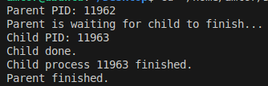

# Практична робота 10-11

## Завдання

### Опис

18. Додайте до програми обробник сигналу SIGCHLD, який буде виводити повідомлення про завершення дочірнього процесу.

### Як працює

Встановлює обробник сигналу SIGCHLD, який спрацьовує, коли завершується дочірній процес. Обробник виводить повідомлення про завершення, використовуючи waitpid().

### [Код до завдання](main.c)

### Результат роботи

Після завершення дочірнього процесу виводиться:

Child process \<pid> finished.

Потім — Parent finished.