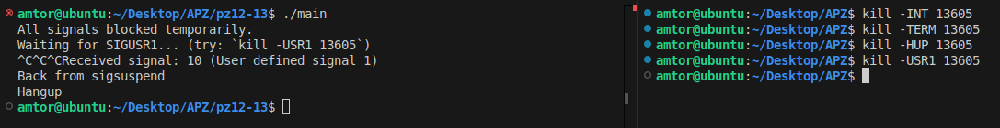

# Практична робота 12-13

## Завдання

### Опис

18. Реалізуйте затримку виконання через sigsuspend, яка одночасно дозволяє приймати деякі сигнали, але ігнорує інші — поясніть, як це безпечно використовувати у багатопотоковому середовищі.

### Як працює

Блокує всі сигнали через sigprocmask().

Дозволяє тільки SIGUSR1 під час sigsuspend() — усі інші сигнали лишаються заблокованими.

Чекає на SIGUSR1, який обробляється, і тоді sigsuspend() повертає управління.

### [Код до завдання](main.c)

### Результат роботи

Виводить повідомлення про очікування SIGUSR1. Коли сигнал отримано — виконує обробник, повертається з sigsuspend() і відновлює попередню маску сигналів.

### Безпека у багатопотоковому середовищі

Чому це безпечно:

- sigprocmask() діє лише на поточний потік — інші потоки продовжують отримувати сигнали.

- sigsuspend() — атомарна операція: одночасно змінює маску сигналів і чекає на сигнал. Це усуває race condition, коли сигнал може надійти між unblock і pause.

- Чіткий контроль: ми явно вказуємо, які сигнали дозволено приймати під час очікування.