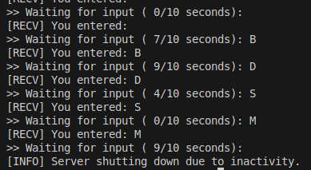

# Практична робота 14

## Завдання

### Опис

18. Реалізуйте механізм автоматичного вимкнення серверу після простою (немає запитів протягом N секунд) із використанням таймера.

### Як працює
Встановлює таймер на N секунд (TIMEOUT). Якщо користувач нічого не вводить, таймер спрацьовує і викликає сигнал SIGALRM, що встановлює прапорець stop_server. Коли користувач вводить дані — таймер скидається і відлік починається знову. Якщо вхід відсутній довше за TIMEOUT, сервер завершує роботу.

### [Код до завдання](main.c)

### Результат роботи

Сервер чекає вводу, скидає таймер при активності. Після N секунд бездіяльності виводить повідомлення про вимкнення та завершується.