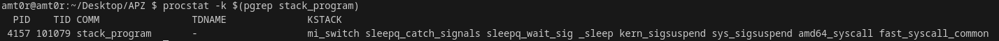

# ЗАВДАННЯ 1

## Умова

Напишіть програму для визначення моменту, коли time_t закінчиться. Дослідіть, які зміни відбуваються в залежності від 32- та 64-бітної архітектури. Дослідіть сегменти виконуваного файлу.

## [Код до завдання](t1/t1.c)

## Пояснення програми

Програма визначає максимальне значення, яке може мати змінна типу `time_t`. Це значення залежить від **архітектури системи** - 32-бітної або 64-бітної.

- **На 32-бітних системах** `time_t` зазвичай є 32-бітним цілим числом зі знаком, тому його максимальне значення - 2 147 483 647 секунд від початку епохи UNIX (1970-01-01). Це відповідає **19 січня 2038 року** - після цього значення переповнюється, що призводить до **помилок у роботі з часом**.

- **На 64-бітних системах** `time_t`, як правило, має 64 біти, що дозволяє представляти дати на мільярди років уперед.

## Результат роботи


---

# ЗАВДАННЯ 2

## Умова

Розгляньте сегменти у виконуваному файлі.

1. Скомпілюйте програму "hello world", запустіть ls -l для виконуваного файлу, щоб отримати його загальний розмір, і запустіть size, щоб отримати розміри сегментів всередині нього.

2. Додайте оголошення глобального масиву із 1000 int, перекомпілюйте й повторіть вимірювання. Зверніть увагу на відмінності.

3. Тепер додайте початкове значення в оголошення масиву (пам’ятайте, що C не змушує вас вказувати значення для кожного елемента масиву в ініціалізаторі). Це перемістить масив із сегмента BSS у сегмент даних. Повторіть вимірювання. Зверніть увагу на різницю.

4. Тепер додайте оголошення великого масиву в локальну функцію. Оголосіть другий великий локальний масив з ініціалізатором. Повторіть вимірювання. Дані розташовуються всередині функцій, залишаючись у виконуваному файлі? Яка різниця, якщо масив ініціалізований чи ні?

5. Які зміни відбуваються з розмірами файлів і сегментів, якщо ви компілюєте для налагодження? Для максимальної оптимізації?

Проаналізуйте результати, щоб переконатися, що:

● сегмент даних зберігається у виконуваному файлі;

● сегмент BSS не зберігається у виконуваному файлі (за винятком примітки щодо його вимог до розміру часу виконання);

● текстовий сегмент більшою мірою піддається перевіркам оптимізації;

● на розмір файлу a.out впливає компіляція для налагодження, але не сегменти.

---
### 2.1
---

## [Код до завдання](t2/hello.c)

## Пояснення програми

Це програма, яка демонструє розміри базового виконуваного файлу. Виконуваний файл містить тільки текстовий сегмент із кодом програми.

## Результат роботи


---	
### 2.2
---

## [Код до завдання](t2/hello_bss.c)

## Пояснення програми

Глобальний масив додається до сегмента BSS, який не зберігається у виконуваному файлі, але резервується під час виконання. Розмір виконуваного файлу незначно змінюється, однак обсяг пам’яті, необхідний для виконання програми, збільшується.

## Результат роботи


---
### 2.3
---

## [Код до завдання](t2/hello_data.c)

## Пояснення програми

Глобальний масив із початковим значенням переміщається з сегмента BSS до сегмента DATA. Це впливає на розмір виконуваного файлу, оскільки сегмент DATA зберігається у ньому.

## Результат роботи


---
### 2.4
---

## [Код до завдання](t2/hello_stack.c)

## Пояснення програми

Локальні масиви створюються в стеку під час виконання програми. Масив без ініціалізації розміщується в стеку, а масив із ініціалізацією додає додаткові дані до текстового сегмента. Виконуваний файл змінюється лише через наявність ініціалізованого масиву.

## Результат роботи


---
### 2.5
---

## [Код до завдання](t2/hello.c)

## Пояснення програми

Налагодження (-g)

Файл може вирости на кілька десятків КБ, бо дебаг-символи записуються в ELF.
size hello покаже те ж саме (бо size не враховує debug-інфу).

Оптимізація (-O3)

Розмір може трохи зменшитись, а секція text — бути компактнішою, бо зайве оптимізується.
## Результат роботи


---

# ЗАВДАННЯ 3

## Умова

Скомпілюйте й запустіть тестову програму, щоб визначити приблизне розташування стека у вашій системі:

```c

#include <stdio.h>

  

int main() {

        int i;

        printf("The stack top is near %p\n";, &amp;i);

        return 0;

}

```

Знайдіть розташування сегментів даних і тексту, а також купи всередині сегмента даних, оголосіть змінні, які будуть поміщені в ці сегменти, і виведіть їхні адреси. Збільшіть розмір стека, викликавши функцію й оголосивши кілька великих локальних масивів. Яка зараз адреса вершини стека?

---
### 3.1
---

## [Код до завдання](t3/stack.c)

## Пояснення програми

global_var — глобальна змінна з ініціалізацією, зберігається в сегменті .data.

local_var і i — локальні змінні, зберігаються в стеку.

Програма виводить адреси змінних, щоб показати, де саме в памʼяті вони розташовані. Це допомагає зрозуміти структуру памʼяті програми:

глобальні змінні мають статичну адресу в .data,

локальні змінні — динамічну, і лежать у стеку, який зазвичай росте вниз (адреси зменшуються).

## Результат роботи


---
### 3.2
---

## [Код до завдання](t3/stack_array.c)

## Пояснення програми

Стек росте вниз — тобто змінні, оголошені пізніше, лежать вище за адресою.

Великий масив local_array займає великий шматок стеку й впливає на положення змінних.

Адреси x, local_array, i допомагають побачити, як усе розташовано в памʼяті.

## Результат роботи


# ЗАВДАННЯ 4

## Умова

Ваше завдання – дослідити стек процесу або пригадати, як це робиться. Ви можете:

● Автоматично за допомогою утиліти gstack.

● Вручну за допомогою налагоджувача GDB.

## [Код до завдання](t4/stack_program.c)

## Пояснення програми

Програма демонструє вкладені виклики функцій із передачею керування через `main()`, `foo()`, `bar()` та `bar_is_now_closed()` і подальше блокування на системному виклику `pause()`. Кожна функція виводить адресу своєї локальної змінної, дозволяючи відстежувати зміни в стеку. Завдання передбачає дослідження стеку процесу за допомогою інструментів procstat та GDB для порівняння їхньої функціональності.


## Результат роботи

Запуск програми та GDB:





# ЗАВДАННЯ 5

## Умова

Відомо, що при виклику процедур і поверненні з них процесор використовує стек. Чи можна в такій схемі обійтися без лічильника команд (IP), використовуючи замість нього вершину стека? Обґрунтуйте свою відповідь та наведіть приклади.

## [Код до завдання](t5/error.c)

## Пояснення програми

Повернення з функції — це не просто зсув указівника стека, а ще й стрибок на адресу повернення, яку ret бере зі стека і кладе в IP (instruction pointer).

У програмі ми вручну видалили адресу повернення, але не задали, куди повертатись, тому CPU після func() просто йде куди попало — або краш, або дивна поведінка.

Чи можна обійтись без IP, використовуючи лише стек?

Ні. Ось чому:

Стек лише зберігає адресу повернення, а IP (Instruction Pointer) вказує, яку інструкцію виконувати далі.

Якщо немає IP, CPU не знатиме, куди стрибнути після виклику функції.

Навіть якщо ти зберігаєш адреси в стеку, їх хтось має взяти зі стека і стрибнути на них — саме це й робить ret, а працює воно через IP.

## Результат роботи


# ЗАВДАННЯ ПО ВАРІАНТАХ
  
## Умова

18. Використайте ptrace() для перегляду пам’яті іншого процесу.
  
## [Код до завдання](t6/t6.c)

## Пояснення програми

Ця програма демонструє, як за допомогою системного виклику ptrace() можна підключитись до іншого процесу в Linux і прочитати його пам’ять. Вона приймає ідентифікатор процесу (PID) як аргумент командного рядка, відкриває файл /proc/<PID>/maps, щоб дізнатися, з якої адреси починається перший сегмент пам’яті процесу, і намагається прочитати дані з цієї адреси. Після отримання адреси, програма прикріплюється до цільового процесу за допомогою PTRACE_ATTACH, зупиняє його (waitpid), читає одне машинне слово з пам’яті (PTRACE_PEEKDATA) і виводить результат. Потім процес від’єднується (PTRACE_DETACH) і завершується.

Цей приклад ілюструє базову техніку інспекції пам’яті інших процесів — часто застосовується в налагоджувачах, інструментах моніторингу або навіть руткітах. Програма підтверджує, що з достатніми правами (зазвичай root або той самий користувач) можна звертатись до чужої пам’яті, якщо знати правильну адресу. Команда ps aux | grep firefox згадується для того, щоб знайти PID процесу, наприклад, браузера Firefox, з якого потім можна зчитати дані.

## Результат роботи

