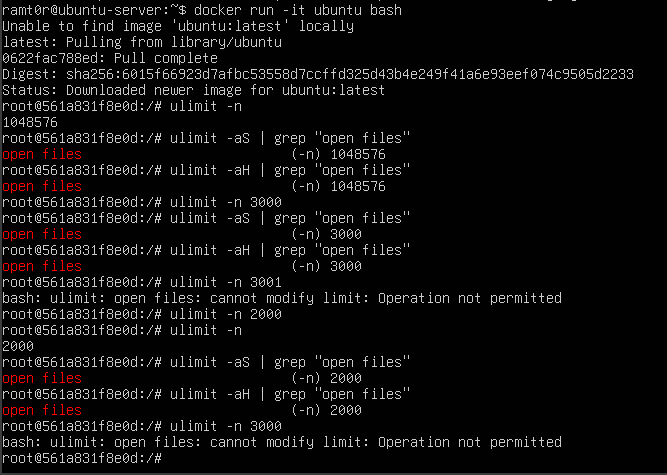

# Практична робота 3

## Завдання 3.1

### Опис
Запустіть Docker-контейнер і поекспериментуйте з максимальним лімітом ресурсів відкритих файлів. Для цього виконайте команди у вказаному порядку:
```
$ ulimit -n
$ ulimit -aS | grep "open files"
$ ulimit -aH | grep "open files"
$ ulimit -n 3000
$ ulimit -aS | grep "open files"
$ ulimit -aH | grep "open files"
$ ulimit -n 3001
$ ulimit -n 2000
$ ulimit -n
$ ulimit -aS | grep "open files"
$ ulimit -aH | grep "open files"
$ ulimit -n 3000
```
Як наступне вправу, повторіть перераховані команди з root-правами.

### Процес виконання
1. Запустіть Docker-контейнер з образом Ubuntu:
   ```sh
   docker run -it ubuntu bash
   ```
2. Виконайте послідовно всі команди, зазначені у завданні, як звичайний користувач. Зверніть увагу на повідомлення про помилки при спробі встановити ліміт вище максимально дозволеного.
3. Повторіть ті ж команди з root-правами (наприклад, через `sudo su`).
4. Порівняйте значення лімітів для звичайного користувача та root.

### Результати
- На початку побачите поточний ліміт відкритих файлів.
- Після зміни ліміту на 3000 значення зміниться.
- При спробі встановити ліміт вище максимально дозволеного (`ulimit -n 3001`) — отримаєте повідомлення про помилку.
- Для root-прав ліміти можна підвищувати.
- Після кожної зміни перевіряйте поточні значення командою `ulimit -n` та через `ulimit -aS | grep "open files"`.

### Скріншот виконання

з root (можна підіймати ліміти)


---

## Завдання 3.2

### Опис
У Docker-контейнері встановіть утиліту perf(1). Поекспериментуйте з досягненням процесом встановленого ліміту.

### Процес виконання
1. Запустіть контейнер Ubuntu:
   ```sh
   docker run -it ubuntu bash
   ```
2. Встановіть утиліту perf:
   ```sh
   apt update && apt install -y perf
   ```
3. Запустіть команду для збору статистики:
   ```sh
   perf stat -e cycles,instructions ls
   ```
4. Встановіть ліміт на кількість відкритих файлів або інший ресурс (наприклад, через `ulimit -n 10`) і спробуйте запустити perf для процесу, який відкриває багато файлів.
5. Спостерігайте за поведінкою perf при досягненні ліміту (можливі помилки, попередження, неповна статистика).

### Результати
Встановлення лімітів за допомогою команди ulimit -u впливає на кількість запущених процесів користувачем, а не системою загалом, тож дана команда виявиться марною.

Бачимо скільки ресурсів займає скрипт test.sh. perf top відображає всі активні процес та скільки ресурсів займає кожен з них наживо, -p фільтрує вивід за конкретним процесом, а pgrep -d',' -f test.sh знаходить всі процеси, що мають test.sh в імені та виводить їх PID.

### Скріншот виконання


---

## Завдання 3.3

### Опис
Напишіть програму, що імітує кидання шестигранного кубика. Імітуйте кидки, результати записуйте у файл, для якого попередньо встановлено обмеження на його максимальний розмір (max file size). Коректно обробіть ситуацію перевищення ліміту.

## [Код до завдання](t3/a.c)

### Результати
Програма імітує кидання грального кубика та записує результати в файл dice_rolls.txt, доки його розмір не досягне 1000 байтів.

Функція roll_dice() генерує випадкове число від 1 до 6. Кожен кидок записується у файл як окремий рядок ("число\n"). Перед кожним записом перевіряється поточний розмір файлу через get_file_size(). Якщо додавання нового запису перевищить ліміт у 1000 байтів (MAX_FILE_SIZE), цикл зупиняється. Таким чином, програма демонструє як контролювати розмір файлу під час запису.

### Скріншот виконання


---

## Завдання 3.4

### Опис
Напишіть програму, що імітує лотерею, вибираючи 7 різних цілих чисел у діапазоні від 1 до 49 і ще 6 з 36. Встановіть обмеження на час ЦП (max CPU time) і генеруйте результати вибору чисел (7 із 49, 6 із 36). Обробіть ситуацію, коли ліміт ресурсу вичерпано.

## [Код до завдання](t4/lottery.c)

### Результати
Програма генерує випадкові унікальні числа для лотереї та зберігає результат у файл lottery_result.txt.

Вона створює:

7 чисел із діапазону 1–49 (основні),

6 чисел із діапазону 1–36 (бонусні),
сортує їх і записує у файл.

Також вона встановлює обмеження на час роботи процесора: 1 секунда (м’яке) і 2 секунди (жорстке). Якщо ліміт перевищено, викликається обробник cpu_time_exceeded, який завершує програму.


### Скріншот виконання


---

## Завдання 3.5

### Опис
Напишіть програму для копіювання одного іменованого файлу в інший. Імена файлів передаються у вигляді аргументів. Програма має:
- перевіряти, чи передано два аргументи, інакше виводити "Program need two arguments";
- перевіряти доступність першого файлу для читання, інакше виводити "Cannot open file .... for reading";
- перевіряти доступність другого файлу для запису, інакше виводити "Cannot open file .... for writing";		
- обробляти ситуацію перевищення обмеження на розмір файлу.

## [Код до завдання](t5/file_copy.c)

### Результати
Ця програма копіює вміст одного файлу в інший, але з обмеженням: новий файл не повинен перевищувати 1 МБ (MAX_FILE_SIZE).

Вона приймає два аргументи командного рядка: ім’я вхідного файлу й вихідного.

Читає дані блоками по 1024 байти й записує їх у новий файл.

Якщо розмір вихідного файлу перевищує 1 000 000 байт, копіювання припиняється, файл видаляється, і програма завершує роботу з помилкою.

---

## Завдання 3.6

### Опис
Напишіть програму, що демонструє використання обмеження (max stack segment size). Підказка: рекурсивна програма активно використовує стек.

## [Код до завдання](t6/stack_limit.c)

### Результати
- Програма виводить глибину рекурсії до моменту вичерпання стеку.
- Після досягнення ліміту — аварійне завершення програми.

### Скріншот виконання


---

# ЗАВДАННЯ ПО ВАРІАНТАХ
  
## Умова
Написати багатопотокову програму, яка перевіряє вплив ulimit -u.

## [Код до завдання](individual/task.py)

### Результати
Програма створює багато реальних процесів у циклі, запускаючи sleep 1000 через subprocess.Popen()

Встановлення лімітів за допомогою команди ulimit -u впливає на кількість запущених процесів користувачем, а не системою загалом, тож дана команда є марною.


### Скріншот виконання
 