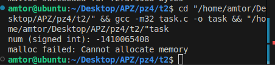

# ЗАВДАННЯ 1

## Опис

Скільки пам'яті може виділити malloc(3) за один виклик?
Параметр malloc(3) є цілим числом типу даних size_t, тому логічно максимальне число, яке можна передати як параметр malloc(3), - це максимальне значення size_t на платформі (sizeof(size_t)). У 64-бітній Linux size_t становить 8 байтів, тобто 8 * 8 = 64 біти. Відповідно, максимальний обсяг пам'яті, який може бути виділений за один виклик malloc(3), дорівнює 2^64. Спробуйте запустити код на x86_64 та x86. Чому теоретично максимальний обсяг складає 8 ексабайт, а не 16?

## Програмна реалізація

Програма виводить максимальне значення size_t, намагається виділити відповідний обсяг пам'яті через malloc і повідомляє про успіх чи невдачу.

## [Код до завдання](t1/max_val.c)


### Результат роботи

Програма виведе максимальне значення size_t (наприклад, 18446744073709551615 на 64-бітній системі). На 32-бітній системі максимальне значення буде меншим.

---
# ЗАВДАННЯ 2

## Опис

Що станеться, якщо передати malloc(3) від'ємний аргумент? Напишіть тестовий випадок, який обчислює кількість виділених байтів за формулою num = xa * xb. Що буде, якщо num оголошене як цілочисельна змінна зі знаком, а результат множення призведе до переповнення? Як себе поведе malloc(3)? Запустіть програму на x86_64 і x86.

## Програмна реалізація

Функції тестують malloc із від'ємним значенням та переповненням int, демонструючи, як це впливає на виділення пам'яті, та який максимальний обсяг можна виділити. Як можна побачити - виділити переповнену пам'ять не вийде, натомість виділиться 0, що є пойнтером-пустишкою. При спробі передати від'ємне значення - malloc відмовляється виділяти.

## [Код до завдання](t2/task.c)




### Результат роботи

при передачі від'ємного значення malloc поверне NULL або не виділить пам'ять. При переповненні int результатом буде від'ємне число, malloc поверне або NULL, або валідний, але "порожній" вказівник. Програма виведе відповідні повідомлення про невдале виділення пам'яті.

---
# ЗАВДАННЯ 3

## Опис

Що станеться, якщо використати malloc(0)? Напишіть тестовий випадок, у якому malloc(3) повертає NULL або вказівник, що не є NULL, і який можна передати у free(). Відкомпілюйте та запустіть через ltrace. Поясніть поведінку програми.

## Програмна реалізація

Викликається malloc(0), перевіряється, чи повертає він NULL, і чи можна безпечно викликати free.

Він повертає не null, а нульовий пойнтер, з коміркою пам'яті якого взаємодіяти не вийде. Проте free все ще можна успішно викликати.

## [Код до завдання](t3/task.c)


### Результат роботи

malloc(0) поверне або NULL, або унікальний вказівник, який можна передати у free(). Програма виведе повідомлення про результат і завершиться без помилок.

---
# ЗАВДАННЯ 4

## Опис

Чи є помилки у такому коді?
```c
void *ptr = NULL;
while (<some-condition-is-true>) {
    if (!ptr)
        ptr = malloc(n);
    [... <використання 'ptr'> ...]
    free(ptr);
}
```

Напишіть тестовий випадок, який продемонструє проблему та правильний варіант коду.

## Програмна реалізація

Демонструється різниця між виділенням і звільненням пам'яті на кожній ітерації циклу та повторним використанням одного блоку.

## [Код до завдання](t4/task.c)


### Результат роботи

при некоректному використанні malloc/free пам'ять буде виділятися і звільнятися на кожній ітерації, що може призвести до витоків або подвійного звільнення. У правильному варіанті пам'ять виділяється один раз і звільняється після завершення циклу.

---
# ЗАВДАННЯ 5

## Опис

Що станеться, якщо realloc(3) не зможе виділити пам'ять? Напишіть тестовий випадок, що демонструє цей сценарій.

## Програмна реалізація

malloc виділяє пам'ять, потім realloc намагається розширити до максимально можливого розміру, перевіряється результат.

## [Код до завдання](t5/task.c)


### Результат роботи

realloc не зможе виділити пам'ять, він поверне NULL, а початковий блок залишиться валідним. Програма виведе повідомлення про невдалий realloc і звільнить початкову пам'ять.

---
# ЗАВДАННЯ 6

## Опис

Якщо realloc(3) викликати з NULL або розміром 0, що станеться? Напишіть тестовий випадок.

## Програмна реалізація

Перевіряється, як realloc поводиться як malloc, якщо перший аргумент NULL, і що відбувається при зменшенні розміру до 0.

## [Код до завдання](t6/task.c)


### Результат роботи

realloc(NULL, size) поводиться як malloc(size), а realloc(ptr, 0) поводиться як free(ptr) і повертає NULL. Програма виведе відповідні повідомлення.

---
# ЗАВДАННЯ 7

## Опис

Перепишіть наступний код, використовуючи reallocarray(3):
```c
struct sbar *ptr, *newptr;
ptr = calloc(1000, sizeof(struct sbar));
newptr = realloc(ptr, 500*sizeof(struct sbar));
```

Порівняйте результати виконання з використанням ltrace.

## Програмна реалізація

Виділяється масив структур, потім змінюється його розмір через realloc та reallocarray, перевіряється результат.

## [Код до завдання](t7/realloc.c)
## [Код до завдання](t7/reallocarray.c)


### Результат роботи

обидва способи (realloc і reallocarray) змінять розмір масиву, але reallocarray додатково захищає від переповнення при обчисленні розміру. Програма виведе адреси виділеної пам'яті до і після зміни розміру.

---
# ЗАВДАННЯ ПО ВАРІАНТАХ

## Опис

18. Використайте mmap() для створення пам’яті, яку не звільняє ОС після завершення програми.

## Програмна реалізація

Використати mmap() з прапором MAP_SHARED для відображення файлу в оперативну пам’ять. Оскільки зміни в пам’яті з прапором MAP_SHARED автоматично синхронізуються з файлом, дані залишаються на диску навіть після завершення програми.
Основні кроки:

Створюємо або відкриваємо файл mapped_file.bin з правами читання/запису.

Встановлюємо розмір файлу на 4096 байт за допомогою ftruncate().

Відображаємо файл у пам’ять через mmap() з MAP_SHARED, тобто зміни в пам’яті зберігаються у файлі.

Записуємо дані в пам’ять, які фактично записуються у файл.

Закриваємо файловий дескриптор, але відображення в пам’яті залишається активним.

Після завершення програми файл усе ще містить записані дані.

## [Код до завдання](individual/task.c)


### Результат роботи

Програма завершиться, але дані не зникнуть, бо вони записані в сам файл mapped_file.bin.
Якщо відкрити цей файл після завершення програми, в ньому буде збережений текст.