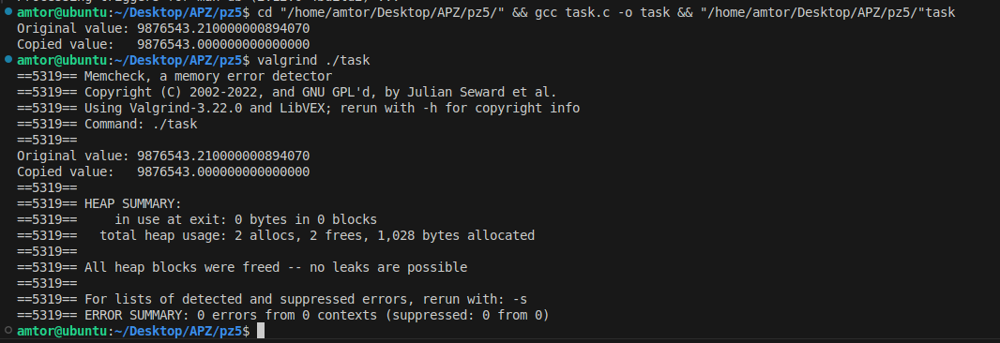

# Практична робота 5

### Опис

Напишіть код, в якому неправильне приведення типів призводить до втрати частини даних при копіюванні у динамічну пам’ять.

### Програмна реалізація

Змінна original типу double містить число з високою точністю.

Виділяється динамічна пам’ять під float (менша точність).

Значення double приводиться до float і записується в нову змінну.

Виводиться обидва значення для порівняння.

### [Код до завдання](task.c)

### Результат роботи

original містить точне значення: 9876543.210000000000000

*copy втрачає точність через приведення до float, наприклад: 9876543.000000000000000

Видно, що число стало неточним через зменшення розрядності.