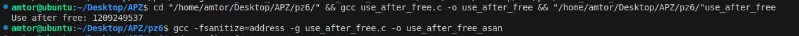
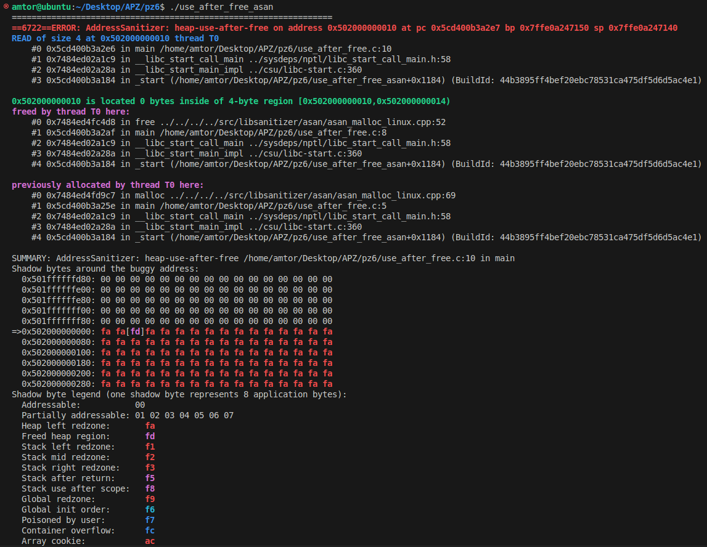
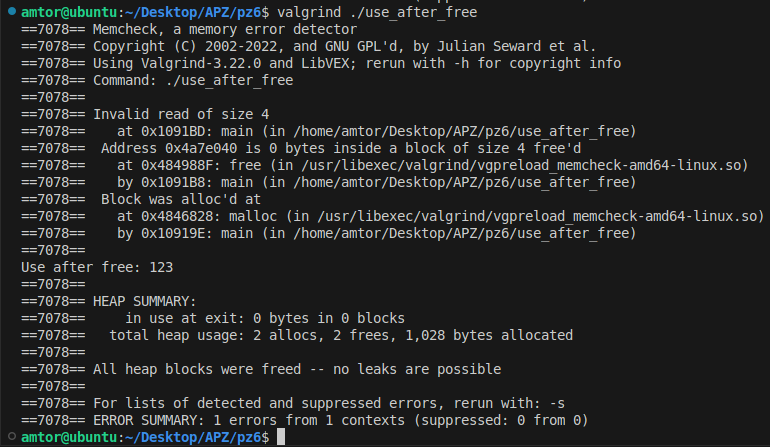

# Практична робота 6

### Опис

18. Test Case #8: Use-after-free. Порівняйте звіт ASan із Valgrind.

### Програмна реалізація

Виділяється пам’ять для int.

Значення 123 записується і пам’ять звільняється.

Після free() відбувається читання з вивільненої пам’яті (use-after-free).

### [Код до завдання](use_after_free.c)

### Результат роботи

ASan: одразу показує точну адресу, що доступ до пам’яті був після free, з контекстом і стек-трейсом.

Valgrind: також виявляє помилку Invalid read, але повільніше й з менш деталізованим звітом.