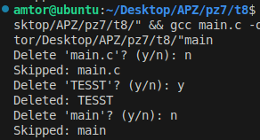

# Практична робота №7

## Задача 1
**Завдання:**
Використайте `popen()`, щоб передати вивід команди `rwho` до `more` у програмі на C.

**Як працює:**
Програма за допомогою функції `popen()` відкриває канал для читання результату виконання зовнішньої команди `rwho | more`. Весь вивід цієї команди зчитується по рядках і виводиться на екран користувача. Таким чином, користувач бачить інформацію про активних користувачів системи з можливістю посторінкового перегляду, як у стандартній команді `more`.

- [Код до завдання](t1/main.c)
- 
- 
- 

**Результат роботи:**
Програма виведе результат виконання `rwho`, поданий через `more`, з посторінковим переглядом.

---

## Задача 2
**Завдання:**
Імітуйте команду `ls -l` - виведіть список файлів поточного каталогу з правами доступу, власником, групою, розміром і датою.

**Як працює:**
Програма відкриває поточний каталог через `opendir()`, перебирає всі файли та підкаталоги за допомогою `readdir()`. Для кожного об'єкта отримує інформацію через `stat()`, визначає права доступу, власника (`getpwuid()`), групу (`getgrgid()`), розмір і дату зміни. Вся ця інформація виводиться у форматі, максимально наближеному до стандартного виводу `ls -l` у Linux.

- [Код до завдання](t2/main.c)
- 

**Результат роботи:**
Програма виведе вміст каталогу в форматі, подібному до `ls -l`, без виклику сторонніх команд.

---

## Задача 3
**Завдання:**
Реалізуйте спрощену версію утиліти `grep` - друк рядків з файлу, що містять задане слово (аргумент програми).

**Як працює:**
Програма приймає на вхід ім'я файлу та слово для пошуку. Відкриває файл для читання, зчитує його пострічково через `fgets()`. Для кожного рядка перевіряє наявність шуканого слова за допомогою `strstr()`. Якщо слово знайдено, рядок виводиться на екран. Таким чином, користувач бачить лише релевантні рядки з файлу.

- [Код до завдання](t3/main.c)
- 
- 

**Результат роботи:**
Програма виведе всі рядки, які містять вказане слово.

---

## Задача 4
**Завдання:**
Створіть спрощену версію утиліти `more` - вивід файлів з зупинкою кожні 20 рядків до натискання клавіші.

**Як працює:**
Програма відкриває файл, зчитує його по рядках і виводить на екран. Після кожних 20 рядків програма зупиняється і чекає, поки користувач натисне клавішу для продовження. Для цього використовується лічильник рядків і функція очікування вводу. Це дозволяє зручно переглядати великі файли частинами.

- [Код до завдання](t4/main.c)
- 

**Результат роботи:**
Програма виведе вміст файлів по 20 рядків з паузою для користувача.

---

## Задача 5
**Завдання:**
Перелічіть усі файли поточного каталогу та вкладених підкаталогів.

**Як працює:**
Програма рекурсивно обходить поточний каталог і всі його підкаталоги. Для цього використовується функція, яка відкриває каталог, перебирає всі об'єкти, і якщо знаходить підкаталог - викликає сама себе для нього. Всі знайдені файли та папки виводяться на екран. Це дозволяє побачити повну структуру директорій.

- [Код до завдання](t5/main.c)
- 

**Результат роботи:**
Програма виведе імена всіх файлів і папок у поточній директорії та її підкаталогах.

---

## Задача 6
**Завдання:**
Виведіть список лише підкаталогів у поточному каталозі в алфавітному порядку.

**Як працює:**
Програма відкриває поточний каталог, перебирає всі об'єкти, визначає які з них є підкаталогами (через `stat()` та макрос `S_ISDIR`). Зібрані імена підкаталогів сортуються за алфавітом (через `qsort`) і виводяться на екран.

- [Код до завдання](t6/main.c)
- 

**Результат роботи:**
Програма виведе лише підкаталоги, впорядковані за алфавітом.

---

## Задача 7
**Завдання:**
Знайдіть усі виконувані C-програми користувача. Запитайте, чи надати їм право на читання. Якщо так - змініть права.

**Як працює:**
Програма відкриває поточний каталог, перебирає всі файли, для кожного перевіряє права доступу через `stat()`. Якщо файл є виконуваним (`S_IXUSR`), програма виводить його ім'я і запитує у користувача, чи надати дозвіл на читання іншим. Якщо користувач погоджується, права змінюються через `chmod()`. Всі дії супроводжуються повідомленнями про успіх чи помилку.

- [Код до завдання](t7/main.c)
- 

**Результат роботи:**
Інтерактивний запит на надання прав читання для кожного виконуваного файлу.

---

## Задача 8
**Завдання:**
Надайте користувачу можливість видалити будь-який або всі файли у поточному каталозі. Запит на кожне видалення обов'язковий.

**Як працює:**
Програма відкриває поточний каталог, перебирає всі звичайні файли (через `stat()` та `S_ISREG`). Для кожного файлу виводить його ім'я і запитує у користувача підтвердження на видалення. Якщо користувач погоджується, файл видаляється через `remove()`. Програма повідомляє про успішне видалення або помилку.

- [Код до завдання](t8/main.c)
- 

**Результат роботи:**
Інтерактивне видалення файлів з підтвердженням для кожного об'єкта.

---

## Задача 9
**Завдання:**
Виміряйте час виконання фрагмента коду в мілісекундах.

**Як працює:**
Програма використовує функцію `gettimeofday()` для отримання поточного часу до і після виконання певного блоку коду (наприклад, великого циклу). Різниця між цими значеннями обчислюється у мілісекундах і виводиться на екран, що дозволяє оцінити швидкодію фрагмента коду.

- [Код до завдання](t9/main.c)
- 

**Результат роботи:**
Вивід часу виконання циклу або іншого блоку коду.

---

## Задача 10
**Завдання:**
Згенеруйте послідовність випадкових чисел з плаваючою комою в діапазонах:
- [0.0, 1.0]
- [0.0, n], де `n` - дійсне число, задане користувачем.

**Як працює:**
Програма ініціалізує генератор випадкових чисел (`srand(time(NULL))`), генерує випадкові числа через `rand()`, масштабує їх у потрібний діапазон і виводить на екран. Користувач може задати верхню межу діапазону.

- [Код до завдання](t10/main.c)
- 

**Результат роботи:**
Виведення кількох випадкових чисел у заданих діапазонах.

---

## Individual
**Завдання:**
18. Створіть команду, яка дає змогу "перемотати назад" виконання shell-команд (але не через історію).

**Як працює:**
Перед виконанням команди створює копію поточної директорії `.snapshot`. Потім виконує shell-команду, яку передали аргументами. Якщо користувач ввів y, директорія відновлюється зі збереженої копії.

- [Код до завдання](individual/main.c)
- 
- 
- 

**Результат роботи:**
Команда виконується, а за бажанням — усі зміни скасовуються, і стан файлів повертається до попереднього.