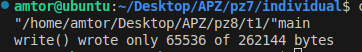
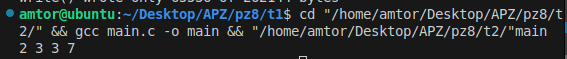
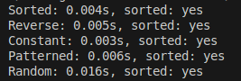
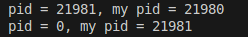
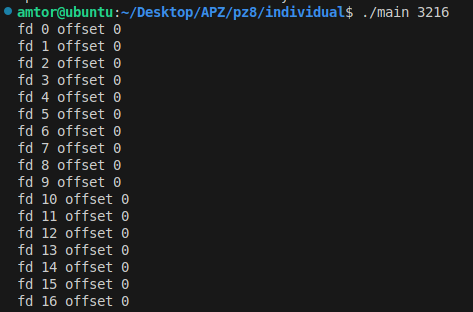

# Практична робота 8

## Завдання 1
**Опис:**
 Чи може виклик count = write(fd, buffer, nbytes); повернути в змінній count значення, відмінне від nbytes? Якщо так, то чому? Наведіть робочий приклад програми, яка демонструє вашу відповідь.

**Як працює:**
Так, виклик write(fd, buffer, nbytes); може повернути значення, менше за nbytes. Це відбувається тому, що функція write не гарантує запис усіх байтів за один виклик.
Програма створює pipe, намагається записати великий буфер через write(). Вона перевіряє, чи повертає write() кількість записаних байтів, меншу за nbytes. Виводиться фактична кількість записаних байтів. 

- [Код до завдання](t1/main.c)
- 

### Результат роботи

Виводиться кількість реально записаних байтів.

---
## Завдання 2
**Опис:**
Є файл, дескриптор якого - fd. Файл містить таку послідовність байтів: 4, 5, 2, 2, 3, 3, 7, 9, 1, 5. У програмі виконується наступна послідовність системних викликів:
lseek(fd, 3, SEEK_SET);
read(fd, &buffer, 4);
де виклик lseek переміщує покажчик на третій байт файлу. Що буде містити буфер після завершення виклику read? Наведіть робочий приклад програми, яка демонструє вашу відповідь.

**Як працює:**
Програма створює файл з вказаною послідовністю байтів, виконує lseek() для переміщення покажчика, потім read() для зчитування 4 байтів у буфер. Виводить вміст буфера після читання.

- [Код до завдання](t2/main.c)
- 

### Результат роботи

Виводиться вміст буфера після read(), прочиталися індекси 3-7, тобто згідно викликів lseek до 3, і прочитати 4.

---
## Завдання 3
**Опис:**
Бібліотечна функція qsort призначена для сортування даних будь-якого типу. Для її роботи необхідно підготувати функцію порівняння, яка викликається з qsort кожного разу, коли потрібно порівняти два значення.
Оскільки значення можуть мати будь-який тип, у функцію порівняння передаються два вказівники типу void* на елементи, що порівнюються.
Напишіть програму, яка досліджує, які вхідні дані є найгіршими для алгоритму швидкого сортування. Спробуйте знайти кілька масивів даних, які змушують qsort працювати якнайповільніше. Автоматизуйте процес експериментування так, щоб підбір і аналіз вхідних даних виконувалися самостійно.

Придумайте і реалізуйте набір тестів для перевірки правильності функції qsort.

**Як працює:**
Програма реалізує функцію порівняння для qsort, генерує різні масиви (включаючи ті, що можуть бути найгіршими для швидкого сортування), автоматично вимірює час сортування для кожного з них, аналізує результати та виводить, які масиви є найгіршими. Також запускаються тести для перевірки правильності сортування.

- [Код до завдання](t3/main.c)
- 

### Результат роботи

Виводиться час сортування для різних масивів, результати тестів та аналіз найгірших випадків для qsort.

---
## Завдання 4
**Опис:**
 Виконайте наступну програму на мові програмування С:
```c
int main() {
  int pid;
  pid = fork();
  printf("%d\n", pid);
}
```
Завершіть цю програму. Припускаючи, що виклик fork() був успішним, яким може бути результат виконання цієї програми?

**Як працює:**
Програма викликає fork(), після чого у батьківському процесі pid містить PID дочірнього процесу, а у дочірньому - 0. В обох процесах виконується printf, тому на екран виводиться два значення: 0 (від дочірнього) і PID дочірнього процесу (від батьківського). Програма завершується для обох процесів.

- [Код до завдання](t4/main.c)
- 

### Результат роботи

На екрані з'являються два числа: 0 та PID дочірнього процесу. Це демонструє розгалуження виконання після fork().

---
## Individual
**Опис:**
18. Реалізуйте команду, яка виводить зсуви (offset) усіх відкритих файлів у процесі, який ви не створювали.

**Як працює:**
Бере PID процесу, відкриває каталог /proc/<pid>/fdinfo, читає зсув (pos) для кожного відкритого файлу в процесі й виводить його.

- [Код до завдання](individual/main.c)
- 

### Результат роботи
Показує зміщення (offset) для кожного відкритого дескриптора файлу заданого процесу.